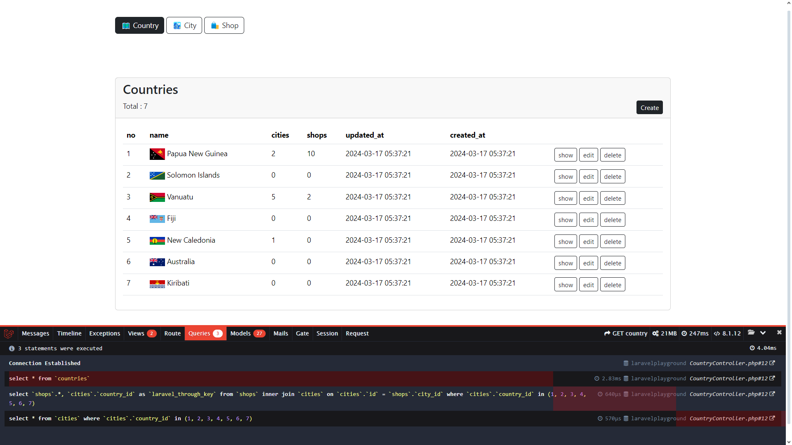

# Laravel Playground

## Project Overview
Project ini dibuat untuk mempelajari dan mendalami pengembangan aplikasi web menggunakan dengan konsep TALLSTACK.
Dalam satu repository ini terdapat 2 pola pengembangan, yaitu : 
<ul>
    <li>Pengembangan menggunakan Laravel (Laravel, Bootstrap 5.3)</li>
    <li>Pengembangan menggunakan TALLSTACK (Tailwind, Alpine.js, Laravel dan Livewire)</li>
</ul>

## Project Screenshots

Tampilan halaman Country


## 📙 Installation

Cara mendownload project melalui GitHub ke local repository.

### Download project
```
git clone https://github.com/janzenfaidiban/laravel-livewire-plygrounds.git
```

### Composer Install

```
composer install
```

### Setup .env

Copy the ```.env.example``` file

### Do the migration & seeder

```
php artisan migrate:fresh --seed
```

### Install Laravel Debugbar

Source & documentations
https://github.com/barryvdh/laravel-debugbar

Installation using composer

```
composer require barryvdh/laravel-debugbar --dev
```

# 🎯 TODOS

Daftar setiap tugas yang harus dilakukan dan informasi folder / file yang perlu diakses oleh para pengembang.

### 📁 Models

Model untuk mengolah fungsi data pada project laravel

```
.
├── app
│   ├── Models
|   |    ├── City.php ✅
|   |    ├── Country.php ✅
|   |    ├── Shop.php ✅
|   |    ├── User.php ✅
│   |    └── ...
```

### 📁 Migration

File migrasi untuk membuat table pada database

```
.
├── database
│   ├── migrations
|   |    ├── 2014_10_12_000000_create_users_table.php ✅
|   |    ├── 22024_03_17_025921_create_countries_table.php ✅
|   |    ├── 2024_03_17_031854_create_cities_table.php ✅
|   |    ├── 2024_03_17_032420_create_shops_table.php ✅
│   |    └── ...
│   ├── seeders
|   |    ├── CountrySeeder.php ✅
|   |    ├── CitySeeder.php ✅
|   |    ├── ShopSeeder.php ✅
|   |    ├── DatabaseSeeder.php ✅
│   |    └── ...
```

## ⭐ LARAVEL

### 📁 Controllers

File controller untuk project laravel

```
.
├── app
|   ├── Http
|   |   ├── Controllers
|   |   |   ├── CountryController.php⏳
|   |   |   ├── CityController.php⏳ 
|   |   |   ├── ShopController.php⏳
│   |   |   └── ...
```

### 📁 Views

Halaman blade untuk project laravel

```
.
├── resources
|   ├── views
|   |   ├── layouts
|   |   |   ├── app.blade.php⏳ 
|   |   ├── country
|   |   |   ├── index.blade.php⏳ 
|   |   |   ├── show.blade.php⏳ 
|   |   |   ├── edit.blade.php⏳ 
│   |   |   └── ...
|   |   ├── city
|   |   |   ├── index.blade.php⏳ 
|   |   |   ├── show.blade.php⏳ 
|   |   |   ├── edit.blade.php⏳ 
│   |   |   └── ...
|   |   ├── shop
|   |   |   ├── index.blade.php⏳ 
|   |   |   ├── show.blade.php⏳ 
|   |   |   ├── edit.blade.php⏳ 
│   |   |   └── ...
```

### 📁 Routes

File & folder routes untuk project laravel

```
.
├── routes
|   ├── web.php
|   ├── laravel
|   |   ├── country.php
|   |   ├── city.php
|   |   ├── shop.php
│   |   └── ...
```

## ⭐ LIVEWIRE

### 📙 Installation

Menginstall NPM packages
```
npm install
```

Menjalankan development project
```
npm run dev
```

Apabila terjadi error pada saat menjalankan ```npm run dev```, bisa dikarenakan oleh beberapa hal berikut : 
<ul>
    <li>sistem operasi yang digunakan oleh para developer berbeda, sehingga packages yang terinstal juga berbeda. Yang perlu dilakukan adalah menghapus folder <b>node_modules</b> dan file <b>package-lock.json</b>.</li>
    <li>Jalankan kembali perintah <code>npm install</code> </li>
    <li>Jalankan juga perintah <code>php artisan optimize:clear</code></li>
    <li>Setelah itu coba lagi jalankan <code>npm run dev</code> </li>
</ul>

### 📁 Directories

Folder dan file yang digunakan untuk project livewire

```
.
├── app
│   ├── Livewire
|   |    ├── Country ✅
|   |    |   ├── index.php ⌛
│   |    |   └── ...
|   |    ├── City ⌛
|   |    |   ├── index.php ⌛
│   |    |   └── ...
|   |    ├── Shop ⌛
|   |    |   ├── index.php ⌛
│   |    |   └── ...
│   └── ...
├── rosources
│   ├── views
│   |   ├── components ✅
|   |   |   ├── layouts ✅
|   |   |   |   ├── app.blade.php ⌛
|   |   |   ├── modalAlpine.blade.php ⌛
│   |   ├── livewire
|   |   |   ├── country ✅
|   |   |   |   ├── index.blade.php ⌛
|   |   |   ├── city ⌛
|   |   |   |   ├── index.blade.php ⌛
|   |   |   ├── shop ⌛
|   |   |   |   ├── index.blade.php ⌛
│   └── ...
├── routes
|   ├── livewire.php ✅
└── README.md
```

# 📚 LEARNING RESOURCES

Vieos, articles, and urls from any other platforms you can mention bellow here.

## Laravel Eloquent: Deeper Relationships with One Query

Tutorial video by Laravel Daily
https://youtu.be/5s-_SnVl-1g?si=rz_TAErEmOtUR2JS